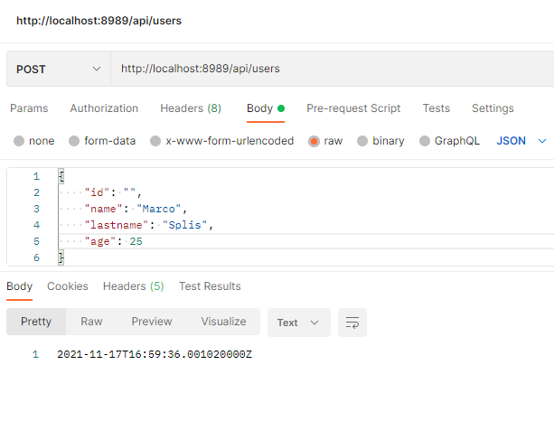
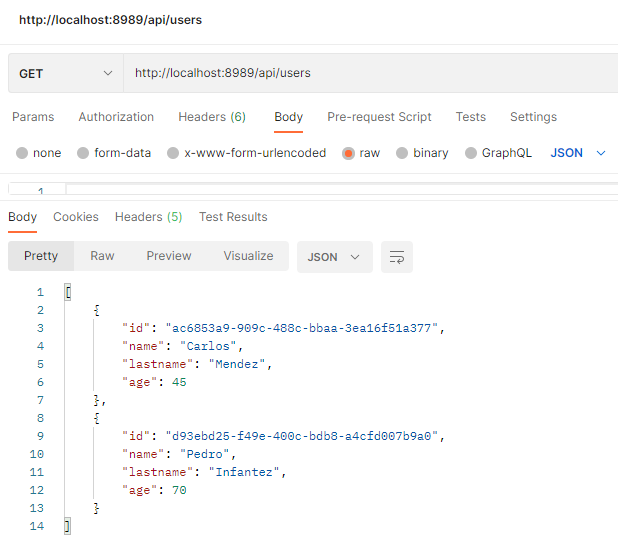
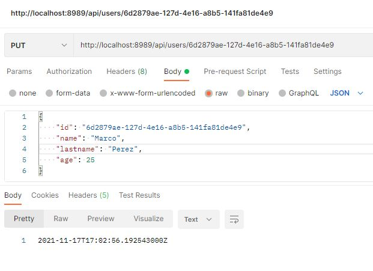
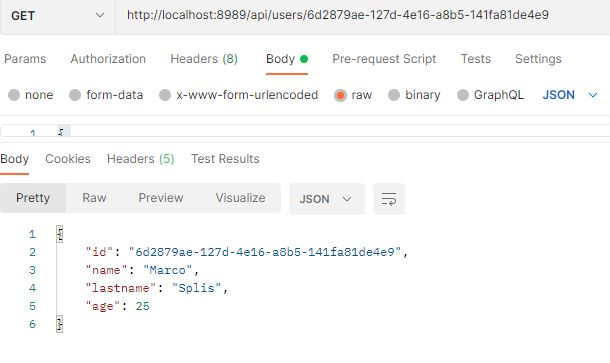
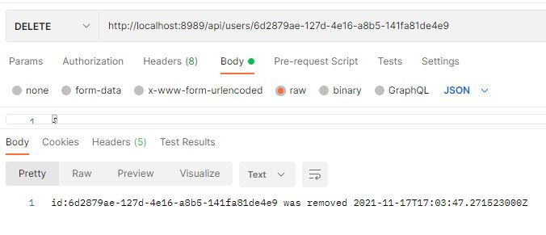

# Spring with Firebase example


Basic rest service with firebase building with:
- [Spring Boot](https://spring.io/)
- [Firebase](https://firebase.google.com/?hl=es-419)


## Run
Using [Java 11+](https://jdk.java.net/11/)
```sh
mvn spring-boot:run
```
## Configuration
The following default properties are used in the application:
```sh
server.port=8989
```

## Usage

All available application endpoints are test using postman.






